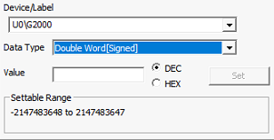
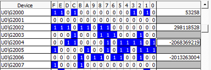
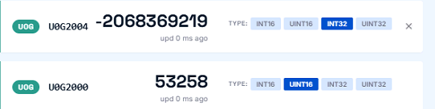
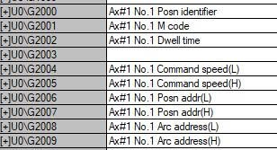
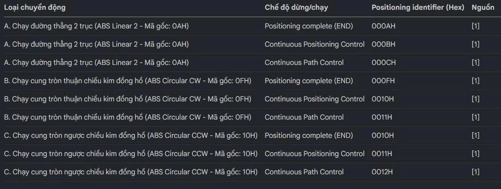

# Cấu Trúc Khung Truyền Dữ Liệu DXF Xuống PLC (Mitsubishi Simple Motion)

Tài liệu này mô tả chi tiết cách thức ứng dụng đóng gói và gửi dữ liệu quỹ đạo từ tab DXF xuống vùng nhớ Buffer Memory của module điều khiển vị trí (Simple Motion).

## 1. Thông Tin Chung

- **Vùng nhớ sử dụng:** Buffer Memory (U0\G).
- **Địa chỉ bắt đầu (Axis 1 - X):** `U0\G2000`.
- **Địa chỉ bắt đầu (Axis 2 - Y):** `U0\G3000`.
- **Kích thước một điểm (Stride):** 10 thanh ghi (10 words).
- **Công thức địa chỉ điểm thứ `n`:** `Địa chỉ = Base + (n-1) * 10 + Offset`.

## 2. Bảng Phân Phối Thanh Ghi (Offsets)

Mỗi điểm (trajectory point) được cấu thành từ 10 thanh ghi 16-bit:

| Offset       | Thông số                        | Kiểu dữ liệu | Mô tả                                                |
| :----------- | :-------------------------------- | :-------------- | :----------------------------------------------------- |
| **+0** | **Positioning Identifier**  | 16-bit          | Mã lệnh chạy (Control Code) & Operation Pattern.    |
| **+1** | **M Code**                  | 16-bit          | Mã phụ (ví dụ:`1` - Bật keo, `0` - Tắt keo). |
| **+2** | **Dwell Time (Low)**        | 16-bit          | Thời gian chờ tại điểm (đơn vị: ms).           |
| **+3** |                                   |                 |                                                        |
| **+4** | **Command Speed (Low)**     | 32-bit (L)      | Tốc độ di chuyển.                                  |
| **+5** | **Command Speed (High)**    | 32-bit (H)      |                                                        |
| **+6** | **Position Address (Low)**  | 32-bit (L)      | Tọa độ đích (mm, tỉ lệ x1000 = µm).            |
| **+7** | **Position Address (High)** | 32-bit (H)      |                                                        |
| **+8** | **Arc Address (Low)**       | 32-bit (L)      | Tọa độ tâm cung tròn (mm, tỉ lệ x1000 = µm).   |
| **+9** | **Arc Address (High)**      | 32-bit (H)      |                                                        |

## 3. Chi Tiết Positioning Identifier (Offset +0)

Thanh ghi này quyết định cách thức robot di chuyển qua điểm đó.

| Lệnh                              | END (Điểm cuối) | Cont. Pos (Nối điểm) | Cont. Path (Nội suy) |
| :--------------------------------- | :----------------- | :---------------------- | :-------------------- |
| **Đường thẳng (Linear)** | `0x100A`         | `0x500A`              | `0xD00A`            |
| **Cung tròn CW**            | `0x100F`         | `0x500F`              | `0xD00F`            |
| **Cung tròn CCW**           | `0x1010`         | `0x5010`              | `0xD010`            |

- **Operation Pattern:**
  - `0x1...`: Independent (Dừng sau khi xong).
  - `0x5...`: Continuous Positioning (Nối điểm có dừng ảo).
  - `0xD...`: Continuous Path (Nối điểm mượt, nội suy liên tục).

## 4. Quy Tắc Ghi Dữ Liệu

- **Thứ tự Word:** Luôn ghi **Low Word** trước (địa chỉ thấp) và **High Word** sau (địa chỉ cao).
- **Đơn vị truyền:** Toàn bộ tọa độ (X, Y, Center X, Center Y) được nhân với **1000** trước khi gửi (để chuyển từ mm sang µm dưới dạng số nguyên 32-bit).
- **M-Code:**
  - `1`: Bật Keo/Pump (trong phạm vi Glue Start/End Index).
  - `0`: Tắt Keo/Di chuyển không tải (Travel move).

## 5. Địa Chỉ Gốc Theo Trục

- **Trục 1 (X & Center X):** `U0\G2000`
- **Trục 2 (Y & Center Y):** `U0\G3000`

*Lưu ý: Dữ liệu tâm (Arc Address) của trục X được ghi vào word +8/+9 của Axis 1, tâm trục Y vào word +8/+9 của Axis 2.*

