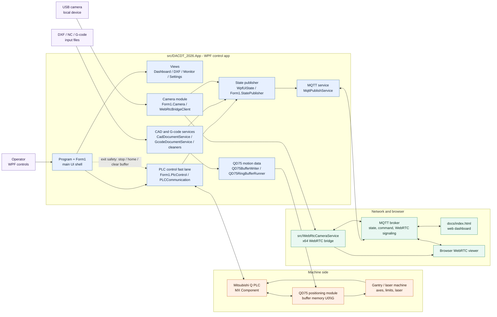

# DACDT 2026 Mermaid Architecture

This diagram summarizes the current project layout and runtime data flow.

Rendered SVG: [dacdt-2026-architecture.svg](dacdt-2026-architecture.svg)

## Main Flow

The WPF app is the center of the system. Operators work through `Form1` and the WPF views. DXF, NC, and G-code files are parsed and cleaned, then converted into QD75 positioning data. The PLC/QD75 path is the realtime machine path; MQTT, the web dashboard, logs, and WebRTC camera streaming sit around it as monitoring and remote-control channels.

## Source Notes

- Main WPF app: `src/DACDT_2026.App`
- Background WebRTC bridge: `src/WebRtcCameraService`
- Web dashboard copied into app output: `docs/index.html`
- Existing interactive SVG diagram: `docs/architecture/dacdt-2026-architecture.html`
